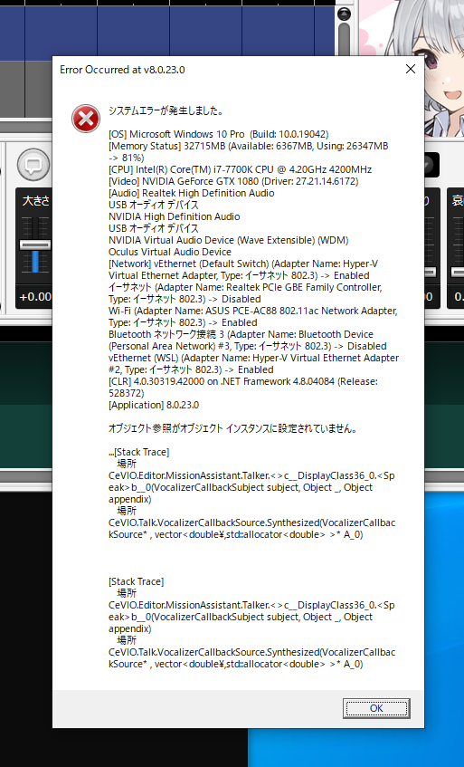

# CeVIO AI システムエラーについての報告

- version: 8.0.23.0

## エラー内容

何度か実行と停止をしていると少しすると次のエラーが出てしまう。



また、場合によっては何もエラーを出さずにCeVIO AIが終了してしまう。

## 実行方法

```
dotnet run
```

## プログラムの説明

キャンセル可能なSpeakのTaskを作成し、連続で無限ループでSpeakとキャンセルを繰り返しています。

キャンセル時に呼び出される`talker.Stop()`の結果のboolをコンソールに表示しています。
そのためターミナルにはTrueがプリントされていくことになります。
